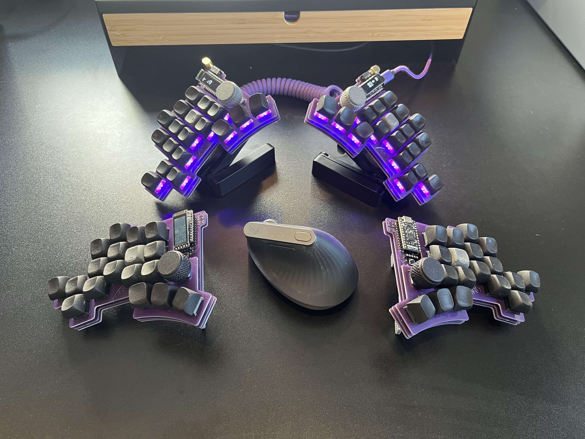

# JWE's custom split keyboard, the Wysteria

This is my custom split 36-key keyboard, with an encoder knob on each hand, and a pinky cluster to avoid stretching my pinky – I find lateral movement easier.

The pcbs, and the source ergogen file used to generate v0.3, can be found in the pcbs folder.

It has working firmware for both QMK and ZMK.

## NOTES
v0.3 has been printed and tested, and is my current daily driver. However, please note that to build it, the diodes on the thumb cluster need to be handwired to the rows. The traces on the PCB itself are incorrect. This has been fixed in the ergogen config file, ready for if and when I print it again, but this has not had all the traces set up in KiCad, and has not been printed or tested.

* Will (should) work with both QMK (with an oled and trrs) and ZMK (with nice!nano and nice!view)
* If using a display, make sure to solder the jumpers _on the opposite side_ of the board to where the dislay is mounted. This is different to the MCU jumpers, which should be soldered on the same side as the MCU (if mounting face-up)
* The ergogen config places an extra diode below the middle finger, bottom row. I manually replace this in KiCad with the Wysteria graphic. (I haven't worked out how to make the graphic into an ergogen-compatible footprint. I'm happy with the manual step for now.)

## Parts used
* [Liatris](https://splitkb.com/collections/keyboard-parts/products/liatris) or [nice!nano](https://splitkb.com/collections/keyboard-parts/products/nice-nano)
* [OLED displays](https://www.aliexpress.com/item/32850288143.html?spm=a2g0o.order_list.order_list_main.40.77df1802Ut4SVX) or [nice!view](https://splitkb.com/collections/keyboard-parts/products/nice-view)
* [Sockets](https://www.aliexpress.com/item/32980406694.html?spm=a2g0o.order_list.order_list_main.5.21ef1802pi0AaX)
* [Batteries](https://www.aliexpress.com/item/4000377326948.html?spm=a2g0o.order_list.order_list_main.29.77df1802Ut4SVX) for wireless builds
* [Reset switches](https://www.aliexpress.com/item/32912263133.html?spm=a2g0o.order_list.order_list_main.15.21ef1802pi0AaX)
* [Hotswap sockets](https://www.aliexpress.com/item/1005003873653184.html?spm=a2g0o.order_list.order_list_main.21.21ef1802pi0AaX)
* [Power switches](https://www.aliexpress.com/item/1005003308186629.html?spm=a2g0o.order_list.order_list_main.26.21ef1802pi0AaX) for wireless builds
* [Socket pins](https://www.aliexpress.com/item/4000062247368.html?spm=a2g0o.order_list.order_list_main.31.21ef1802pi0AaX)
* [Diodes](https://www.aliexpress.com/item/32660088529.html?spm=a2g0o.order_list.order_list_main.5.21ef1802a9afJe)
* [EC11](https://www.aliexpress.com/item/1005003824684681.html?spm=a2g0o.cart.0.0.5d5838daGifwXE&mp=1)
* [EC11 knob](https://github.com/GEIGEIGEIST/KLOR/tree/main/knob) from GEIST
* [M2 screws](url)
* Switches and keycaps (all 1u). My current set-up has [Boba U4](https://splitkb.com/collections/switches-and-keycaps/products/gazzew-boba-u4-silent-tactile-switch?_pos=1&_fid=bebc80122&_ss=c) in the office, [Boba U4Tx](https://splitkb.com/collections/switches-and-keycaps/products/gazzew-boba-u4tx-thocky-tactile-switch?_pos=7&_fid=bebc80122&_ss=c) at home, and [DES](https://github.com/sporkus/PseudoMakeMeKeyCapProfiles/tree/master/stl/MX) printed by JLCPCB

### Tenting set-up

* [Z-fold tripod](https://www.aliexpress.com/item/1005006313678530.html)
* [Magsafe tripod adapter](https://www.aliexpress.com/item/1005006074567830.html)

## To do

If I ever decide to build a new one, want to:

* ~~Fix the problem of the thumb cluster not being in the matrix~~
* Move the thumb keys slightly further down (ie closer to the wrist). My thumbs naturally rest so that only the very tip is on the key.
* Rotate the lateral pinky key by 90 degrees, so that the keycap can be rotated as well.
* Move the lateral pinky key down 2mm.
* Move the reset switch to a more sensible location, though where that is I don't currently know.
* If I am feeling very ambitious, think about making a steel plate as a base, so it attaches cleanly to the magsafe tripod adapter. But I would need to work out how to properly countersink the screws, and rethink where the screws are.

## References

Made based on
* [ergogen](https://github.com/ergogen/ergogen)
* [FlatFootFox's ergogen intro](https://flatfootfox.com/ergogen-introduction/)
* [TSteffek's guide to ergogen v4 compared to v3](https://github.com/tsteffek/Ergogen-V4-Migration-Guide)
* Kvietcong's fork of [ergogen](https://github.com/kvietcong/ergogen) (for the footprints)
* Ceoloide's [corney-island](https://github.com/ceoloide/corney-island)
* Narkoleptika's [josukey](https://github.com/Narkoleptika/josukey)

### Guides for other parts

### Keyboards used as reference
* [Rae-dux](https://github.com/andrewjrae/rae-dux) (especially the build guide from [tzcl](https://www.tzcl.me/blog/rae-dux) for parts references)
* [Claw](https://gitlab.com/Audijo/keyboard) (for ergogen)
* [Piano](https://github.com/benvallack/ergogen/blob/master/input/config-piano.yaml)
* [PicaChoc36](https://github.com/zzeneg/picachoc36) (eg for parts references)
* [Swoop](https://github.com/jimmerricks/swoop) (eg for parts references)
* [Klor](https://github.com/GEIGEIGEIST/KLOR/blob/main/docs/buildguide_acrylic_ble.md)
* [Sofle](https://josefadamcik.github.io/SofleKeyboard/sourcing_parts.html)

### Other references:
* Sadek Baroudi's [guide to making cases](https://github.com/sadekbaroudi/keyboard-guides/blob/master/cases/README.md)
* Ben Vallack's [video on using ergogen](https://www.youtube.com/watch?v=M_VuXVErD6E) (nb: outdated as it is based on ergogen v3)
* [Batteries](https://github.com/joric/nrfmicro/wiki/Batteries#301230)
* The Absolem [build guide](https://zealot.hu/absolem/#build)
